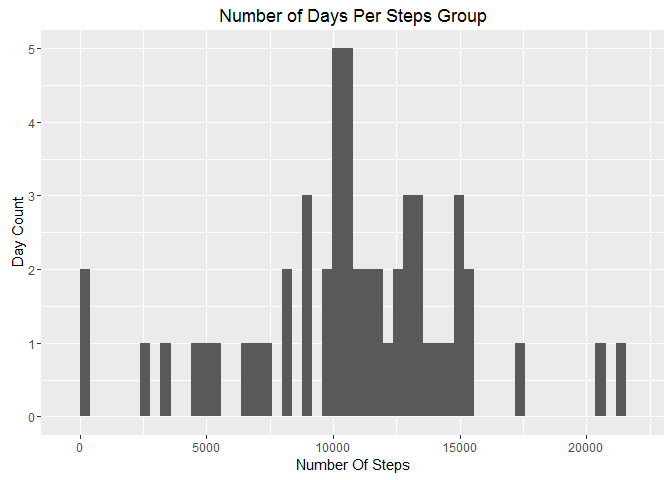
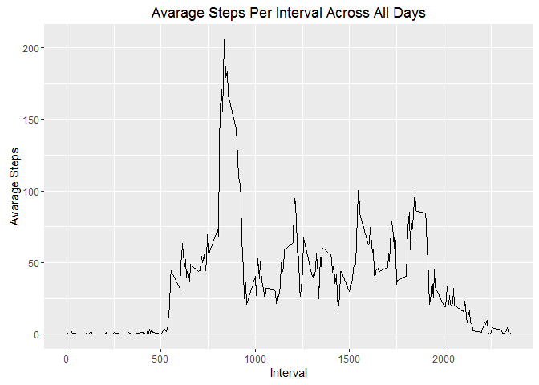
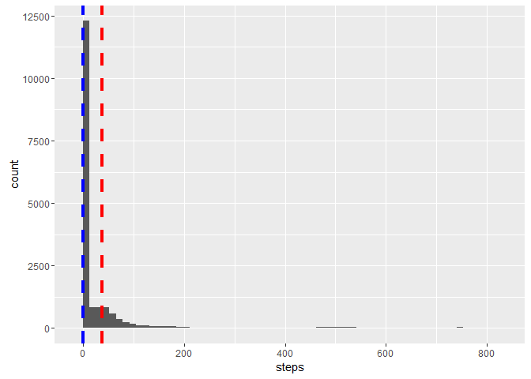

# Reproducible Research: Peer Assessment 1

## Loading and preprocessing the data

```r
library(ggplot2)
library(plyr)
library(dplyr)
```

```
## 
## Attaching package: 'dplyr'
```

```
## The following objects are masked from 'package:plyr':
## 
##     arrange, count, desc, failwith, id, mutate, rename, summarise,
##     summarize
```

```
## The following objects are masked from 'package:stats':
## 
##     filter, lag
```

```
## The following objects are masked from 'package:base':
## 
##     intersect, setdiff, setequal, union
```

```r
if(!file.exists("activity.csv")){
  unzip("activity.zip")
}

df <- read.csv("activity.csv");
df$date <- as.Date(df$date)
df2 <- subset(df,subset = !is.na(df$steps))
```
## What is mean total number of steps taken per day?

```r
totalStepsPerDay <- aggregate(df2$steps,by=list(df2$date),FUN = sum)

qplot(totalStepsPerDay$x,geom="histogram", main="Number of Days Per Steps Group",bins=nrow(totalStepsPerDay), xlab="Number Of Steps", ylab = "Day Count")
```



```r
mean(totalStepsPerDay$x)
```

```
## [1] 10766.19
```

```r
median(totalStepsPerDay$x)
```

```
## [1] 10765
```
## What is the average daily activity pattern?

```r
avgDailyActivity <-aggregate(df2$steps,by=list(df2$interval),FUN = mean)
names(avgDailyActivity) <- c("interval","avg.steps")
qplot(x=avgDailyActivity$interval,y=avgDailyActivity$avg.steps,geom = "line", xlab="Interval", ylab="Avarage Steps",main="Avarage Steps Per Interval Across All Days")
```



```r
# Interval with max avg.steps
avgDailyActivity[order(avgDailyActivity$avg.steps,decreasing = TRUE),][1,]$interval
```

```
## [1] 835
```

## Imputing missing values

```r
# number of rows with missing values
nrow(subset(df,subset = is.na(df$steps)))
```

```
## [1] 2304
```

```r
impute.mean <- function(x) replace(x, is.na(x), mean(x, na.rm = TRUE))
dfm <- ddply(df,~interval, transform, steps = impute.mean(steps))
dfm <- dfm[order(dfm$date,dfm$interval),]

totalStepsPerDay2 <- aggregate(dfm$steps,by=list(dfm$date),FUN = sum)
names(totalStepsPerDay2) <- c("date","steps")

ggplot(dfm,aes(x=steps)) + geom_histogram(bins=nrow(totalStepsPerDay2)) + geom_vline(aes(xintercept=mean(steps,na.rm=TRUE)), color="red", linetype="dashed", size=1.5) + geom_vline(aes(xintercept=median(steps,na.rm=TRUE)), color="blue", linetype="dashed", size=1.5)
```




## Are there differences in activity patterns between weekdays and weekends?

```r
dfm <- mutate(dfm, week = factor(ifelse(weekdays(date) %in% c("Saturday","Sunday"),"weekend","weekday")))

ggplot(dfm,aes(x=interval,y = steps)) + stat_summary(fun.y="mean", geom="line") + facet_grid(week~.)
```


